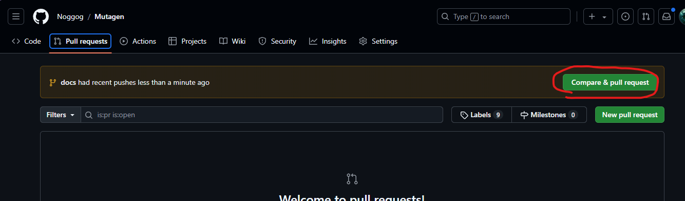

# Contributing
Want to contribute?

## Documentation
Mutagen's documentation itself is able to be contributed to and improved.

The files driving the documentation are [located here](https://github.com/Mutagen-Modding/Mutagen/tree/dev/docs)

They use a system called [Material For MkDocs](https://squidfunk.github.io/mkdocs-material/)

### One Off Improvements
If there's something small like a typo or a single sentence to improve, these can often be done straight from Github's website.

{ align=right width="350" }

This will open an editor and allow you to initiate a PR directly from the website with your changes.

You can of course do the same changes and PR proposals more traditionally by forking, cloning locally, and initiating a PR from there.

### Extensive Improvements
If you're making more extensive improvements, you will likely want to see the results of the changes to the documentation "live" so you can make sure everything is displaying as intended.

This involves:

- Downloading the documentation to your computer

- Installing and running MkDocs locally to see the results as you edit the documentation

- Committing the final results and initiating a PR

To do this, you will want to:

#### Fork Mutagen Repository

This step makes a copy of the Mutagen repo on Github that you have ownership of and can modify and prep your changes.

{ width="350" }

#### Download (Clone)

This step downloads (clones) the fork you just made to your local computer.

[GitKraken](https://www.gitkraken.com/) is a good Git client to help, but there's lots of alternatives

{ width="350" }

#### Installing MkDocs
This is the documentation system Mutagen uses, so you have to install it so it can display the docs as you edit them.

[Installing Material for MkDocs](https://squidfunk.github.io/mkdocs-material/getting-started/)

TLDR: `pip install mkdocs-material` in a command line

#### Running MkDocs
Running `mkdocs serve` on your cloned Mutagen repository 

This step runs MkDocs and tells it to watch Mutagen's documentation and display the changes.   

Control-Click on the "Serving On" address to open it in your browser and see the docs as you write them.

{ width="350" }

#### Edit Documentation

Use the [MkDocs guide](https://squidfunk.github.io/mkdocs-material/reference/) for all the neat things you can do.

#### Commit, Push

This step saves your changes locally and prepares them to be uploaded and merged.

Once committed, you can Push them up to your Fork on GitHub's servers
{ width="350" }

#### Create Pull Request
This step officially makes the request for the Mutagen repository to bring in the changes you made on your Fork.

The easiest way is to click this button, which GitHub shows on your fork's `Pull Requests` tab for a short while after you push

{ width="350" }

After that, the Mutagen team can merge in your documentation updates!   Feel free to comment on the PR itself, or get in touch on [Discord](https://discord.gg/53KMEsW) to chat about what you changed and why.

