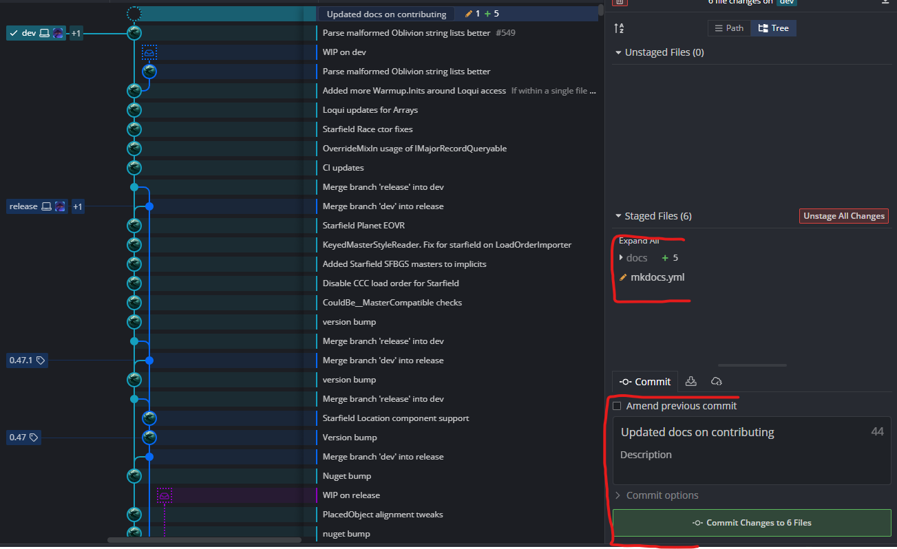

# Contributing
Want to contribute?

## Documentation
Mutagen's documentation itself is able to be contributed to and improved.

The files driving the documentation are [located here](https://github.com/Mutagen-Modding/Mutagen/tree/dev/docs)

They use a system called [Material For MkDocs](https://squidfunk.github.io/mkdocs-material/)

### One Off Improvements
If there's something small like a typo or a single sentence to improve, these can often be done straight from Github's website.

{ align=right width="350" }

This will open an editor, and allow you to Fork and/or initiate a PR directly from the website.

You can of course do the same changes and PR proposals more traditionally by forking, cloning locally, and initiating a PR from there.

### Extensive Improvements
If you're making more extensive improvements, you will likely want to see the results of the changes to the documentation "live" so you can make sure everything is displaying as intended.

This involves:

- Downloading the documentation to your computer

- Installing and running MkDocs locally to see the results as you edit the documentation

- Committing the final results and initiating a PR

To do this, you will want to:

#### Fork Mutagen Repository

{ width="350" }

#### Download (Clone)
Cloning your forked repository to your computer.  [GitKraken](https://www.gitkraken.com/) is a good Git client to help, but there's lots of alternatives

{ width="350" }

#### Installing MkDocs
[Installing Material for MkDocs](https://squidfunk.github.io/mkdocs-material/getting-started/)

TLDR: `pip install mkdocs-material` in a command line

#### Running MkDocs
Running `mkdocs serve` on your cloned Mutagen repository 

{ width="350" }

#### Edit Documentation

Use the [MkDocs guide](https://squidfunk.github.io/mkdocs-material/reference/) for all the neat things you can do.

#### Commit
Commit your changes in Git.  

{ width="350" }