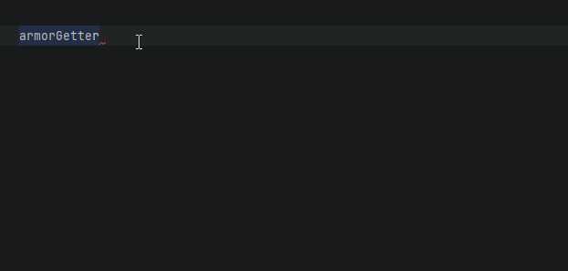
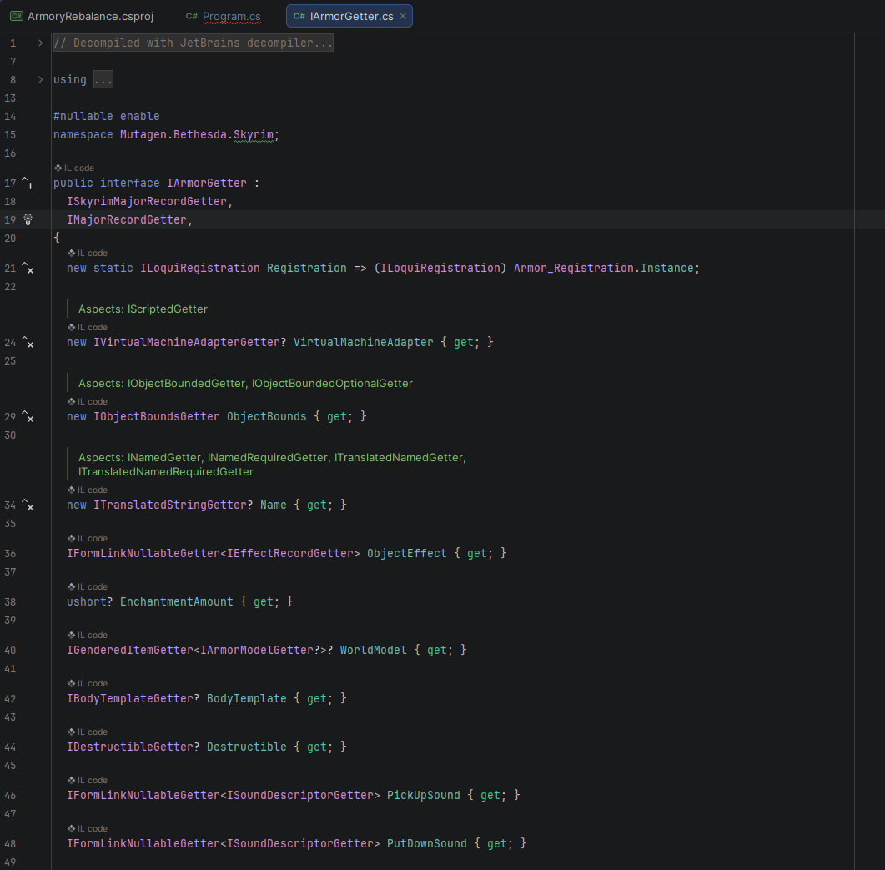

# Specific Records
## Typical API
Mutagen generates thousands of classes and fields for all the records that exist within the Bethesda plugin files.  Writing documentation for every class and field is not feasible:  there are simply too many, and any text written today would drift out of sync with the generated code over time as records and fields evolve.

Autogenerated reference pages may be added at some point, but have been held off so far for similar reasons.  Per-field comments would need to be sourced from somewhere, and as the underlying record definitions change, those comments rot, names drift, and a stale page is often worse than no page at all.

!!! tip "The Code is the Law"
    Whatever the IDE shows you about the generated classes is what is actually true.  Documentation pages can lie; the generated code cannot.

## Discovering Records and Fields with the IDE
Most data exists as fields on objects very similar to the structures found in common tools like xEdit.  If you know what a record looks like in xEdit, the Mutagen class will look very similar: the same record type names, the same field names, organized in roughly the same way.   With that familiarity as a starting point, the IDE does the rest of the work.

### Autocomplete
Start typing the name of the record you are interested in (`Npc`, `Weapon`, `Cell`, etc.) and let IntelliSense show you the available types.   Once you have an instance of a record, typing `.` will list every available field on it, and hovering over a field will show its type and any XML doc comments that exist.

If autocomplete does not surface Mutagen types, the namespace likely is not imported.  Enabling "Show items from unimported namespaces" makes discovery much smoother:

[:octicons-arrow-right-24: Namespaces and Intellisense](../../familiar/Namespaces.md)

### Go to Definition
Pressing `F12` (or your IDE's "Go to Definition" shortcut) on any Mutagen type brings up a readout of that type that can be browsed directly, similar to viewing the source code itself.  This is the fastest way to see every field a record has, the exact type of each field, and which interfaces it implements.

### Getter Interfaces
Most records have a read-only "getter" interface (e.g. `INpcGetter`) alongside the mutable class.  Read-only access typically goes through these interfaces, and they are useful entry points for exploring what a record exposes:

[:octicons-arrow-right-24: Interfaces](../Interfaces.md)

### Abstract Records
Some records are abstract and have multiple concrete subclasses (placed objects, conditions, etc.).  The IDE can enumerate the available subclasses for you:

[:octicons-arrow-right-24: Abstract Subclassing](../Abstract-Subclassing.md)

## Specific Documentation
The Specific Records section is about the abnormal record structures that inspire special documentation to cover specific concepts that might complicate things.

!!! question "Not Exhaustive"
    The current documents can always be expanded.  If you would like one to be outlined, feel free to open an issue to request

Some related documentation about some deviation patterns that might be encountered:

[:octicons-arrow-right-24: Abstract Subclassing](../Abstract-Subclassing.md)

[:octicons-arrow-right-24: Bethesda Format Abstractions](../Bethesda-Format-Abstraction.md)

[:octicons-arrow-right-24: ExtraData (Container Item Ownership)](ExtraData.md)

[:octicons-arrow-right-24: Globals and GameSettings](Globals-And-GameSettings.md)

[:octicons-arrow-right-24: Keywords](Keywords.md)

[:octicons-arrow-right-24: Placed Objects](Placed.md)